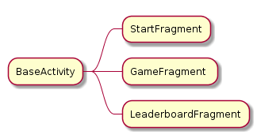
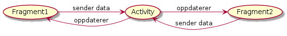
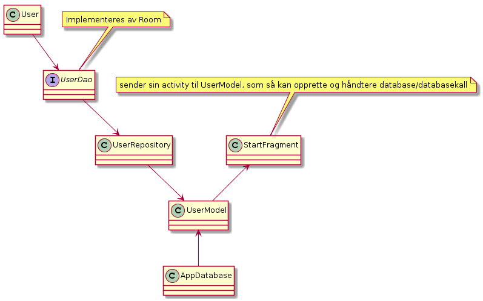
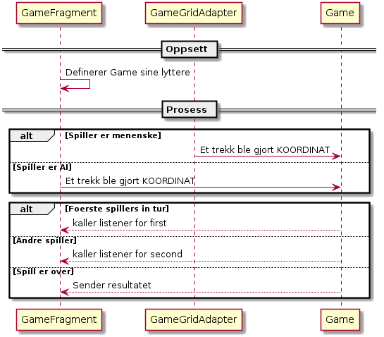
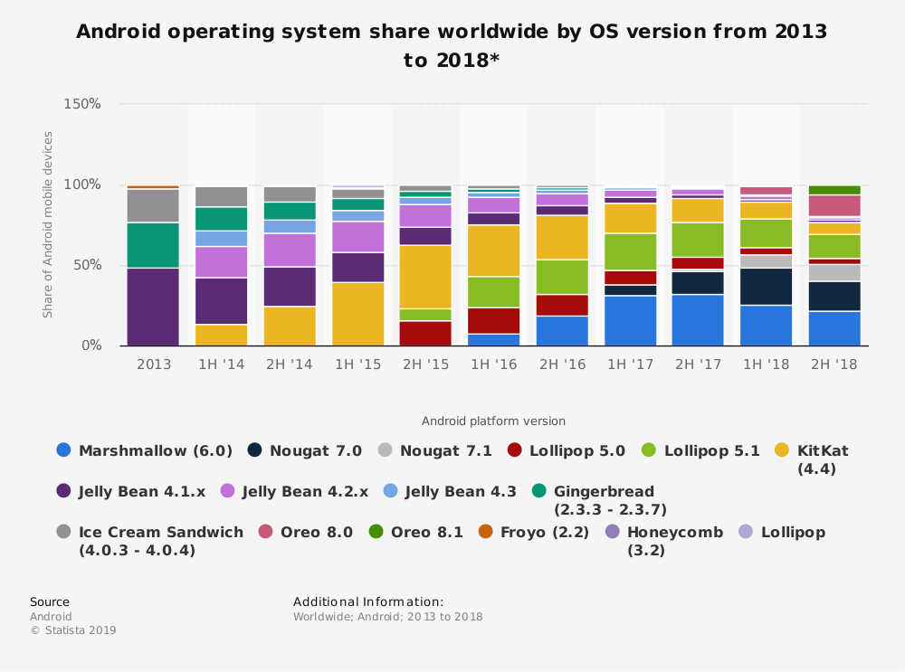
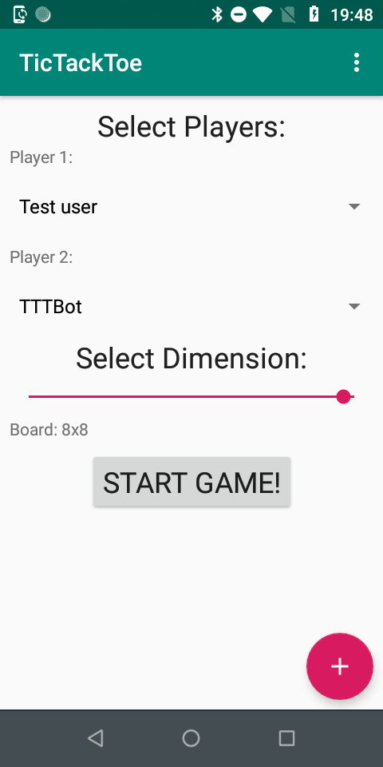
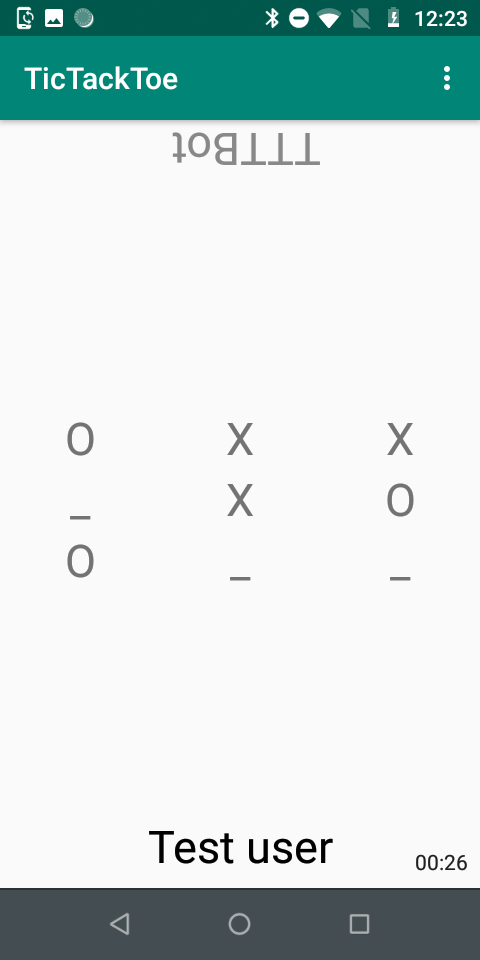
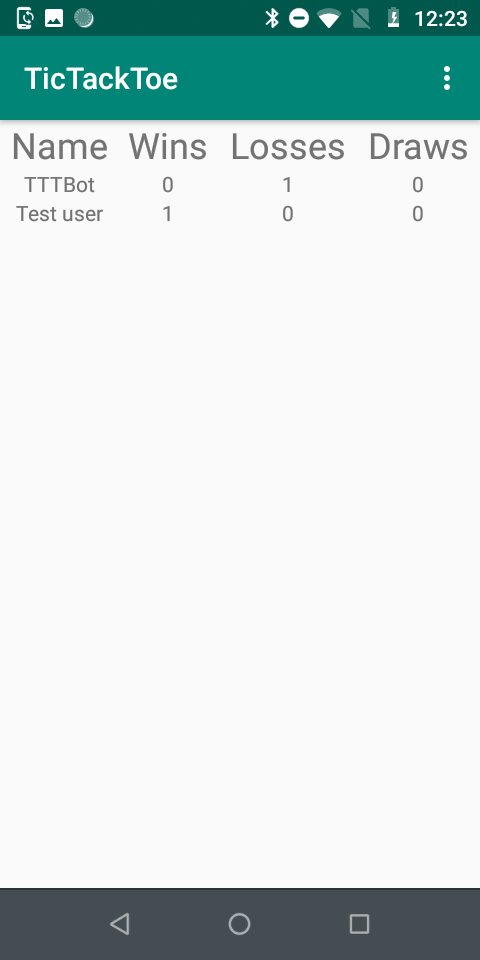

# Dokumentasjon - Tic Tac Toe

- [Dokumentasjon - Tic Tac Toe](#dokumentasjon---tic-tac-toe)
  - [Generelt](#generelt)
  - [Om oppgaven](#om-oppgaven)
  - [Flyt i applikasjonen (hva mapper til hva i oppgaveteksten)](#flyt-i-applikasjonen-hva-mapper-til-hva-i-oppgaveteksten)
  - [Skjermer](#skjermer)
    - [Startskjerm - skjermbilde](#startskjerm---skjermbilde)
    - [Spillskjerm - skjermbilde](#spillskjerm---skjermbilde)
    - [Statistikkskjerm - skjermbilde](#statistikkskjerm---skjermbilde)
  - [Arkitektur](#arkitektur)
    - [Fragments](#fragments)
    - [Deling av data](#deling-av-data)
    - [Room-database](#room-database)
    - [Spillogikk](#spillogikk)
  - [AI](#ai)
  - [Lokal lagring](#lokal-lagring)
  - [Brukertest](#brukertest)
  - [Versjoner](#versjoner)
  - [Biblioteker](#biblioteker)
  - [Visuelt](#visuelt)
  - [Navngivning](#navngivning)
  - [Publisering](#publisering)
  - [Skjermbilder](#skjermbilder)
    - [Bilde skisse](#bilde-skisse)
    - [Bilde Startskjerm](#bilde-startskjerm)
    - [Bilde Spillskjerm](#bilde-spillskjerm)
    - [Bilde Statistikkskjerm](#bilde-statistikkskjerm)
  - [Kildeliste](#kildeliste)


## Generelt
Jeg har bygget en implementasjon av _Tic Tac Toe_, slik oppgaven beskriver.
I dette dokumetnet skal jeg beskrive løsningen min. Det være seg hvordan koden er strukturert,hvorfor den ser ut som den gjør og hvorfor den treffer målet om å være en god applikasjon.

## Om oppgaven 
Oppgaven her var å skrive en appliksasjon som implementerte _Tic Tac Toe_ ("bondesjakke"). I tillegg var det krav om følgende: 
1. Applikasjonen skal ha en fragment-struktur
2. Applikasjonen skal gjøre bruk av lokal lagring 
3. Applikasjonen skal ha logikk for å kunne spille alene mot telefonen

## Flyt i applikasjonen (hva mapper til hva i oppgaveteksten)
Det første som møter brukeren er [startskjermen](###startskjerm). Her kan spilleren velge spillere og størrelse på brettet. Når det er gjort, går man videre til [spillskjermen](###spillskjerm). Det er der selve spillet foregår. Når spillet er slutt, får man opp en varselboks med informasjon om spillets resultat. Varselboksen gir mulighet til å starte på nytt eller gå til [statistikkskjermen](###statistikkskjerm). Statistikkskjermen viser en oversikt over samlede resultater for alle brukere. Applikasjonen gir også mulighet for å bytte fargetema, gjennom en standard-meny i app-baren. Det er mulig å nå statistikkskjermen herfra. 


## Skjermer 
I denne seksjonen skal jeg ta for meg alle skjermene som møter brukeren. Sammen med bildene fra det ferdige produktet, har jeg også lagt ved en [tidilg skisse](#bilde-skisse) av appen, som ble tegnet omtrent da oppgaven ble utlevert.

### Startskjerm - [skjermbilde](#bilde-startskjerm)
Denne skjermen er det første som møter en bruker når appen åpnes. Her velger man to ting: hvem som skal spille og hvor stort brettet skal være. 

Spillerene velges gjennom nedtrekkslister("spinners"). Disse er mye brukt i Android, og de gir mulighet for ett valg. Det er akkurat det jeg ønsker her. I tillegg til å vise ordinære spiller, gir den siste av nedtrekkslistene mulighet for å velge "TTTBot" som motspiller. Spillerene hentes fra applikasjonens lokale ROOM-database. Dersom man ikke har lagt til noen brukere, får man varsel om at det må gjøres før man får lov til å spille. 

Brukere legges enkelt til ved å trykke på en _Floating Action Button_ ("FAB"). En FAB er egentlig ment for å være knappen som utføre hovedfunksjon i et program[<sup>1</sup>](#1). Derfor kan man tenke seg at min bruk ikke er helt 100% korrekt, ettersom hovedfunksjonaliteten er å starte spillet, ikke å legge til brukere. Min egen erfaring med Android (og _Material Design_ generelt) sier at det derimot er veldig vanlig å ha "legg til"-funksjonalitet i slike knapper, med pluss-logo. Jeg fikk heller ingen reaksjoner på det da jeg [brukertestet](#brukertest) appen. Derfor har jeg latt det være. 

Hovedfunksjonaliteten gjøres ved den store "Start Game"-knappen. Den var tydelig for alle jeg viste appen til. 

### Spillskjerm - [skjermbilde](#bilde-spillskjerm)
Her foregår selve spillet. Spillet vises på et kvadratisk brett i midten. Hver "rute" på brettet starter med å innehodle "_". For å gjøre trekk, trykker spilleren bare der trekket skal gjøres. 

Under og over spillet vises de to spillernavnene. På denne måten kan man legge telefonen mellom seg, som med et tradisjonelt brettspill. Navnet på spilleren som venter på motstanderens trekk, vil være grått. I utgangspunktet var dette tenkt å være tydeligere (faret bakgrunn/tydeligere tekster). Jeg oppdaget at brukere synes dette var distraherende. Derfor tonet jeg det ned, og har nå kun grått/svart som bytter. 

### Statistikkskjerm - [skjermbilde](#bilde-statistikkskjerm)
Her vises alle spillere i en tabell, med kolonner for antall seiere, tap og uavgjort-spill. Dette er ikke en side hvor brukeren skal bruke mye tid. Inntrykket mitt var at brukerene som testet appen, synes siden var morsom i kort tid. Deretter ville de vekk, tilbake til selve spillet. 


## Arkitektur

### Fragments 
Programmet bruker en fragment-arkitektur, slik som 
oppgaven spesifiserer. Fragments gir en fordel over activities her fordi de er mindre ressurskrevende å starte opp enn activities. 
Fragments er mer fleksible enn activities var tenkt til å være. De kan gjenbrukes og, dersom man ønsker, kan man ha flere i samme skjerm (f.eks endring ved rotasjon). Det er ikke anbefalt at de skal være så store. De skal dele opp ganske store bolker. 

Jeg bruker kun ett fragment om gangen, og har samme skjerm uavhengig av rotasjon. Derfor er det først og fremst kostnaden ved å starte en fragment som jeg sparer.



Hele appen vises i en felles activity. Dersom en ny skjerm skal vises, byttes bare fragmenten som er aktivt. Dette lar meg bruke alle fordelene som fragments gir. Activity-objektet kan nåes gjennom klassevariabler i Fragments.
```kotlin
fun replaceMainFragment(fragment: Fragment) {

    supportFragmentManager.beginTransaction()
        .addToBackStack(null)
        .replace(R.id.activity_base_frame_layout, fragment)
        .commit()
}
```

### Deling av data 
Data deles mellom de to fragment-klassene gjennom `SharedModel.kt`. Min fremgangsmåte er inspirert av en artikkel skrevet av Shalauddin Ahamad Shuza<sup>2</sup>](#2). 
```kotlin 
class SharedModel: ViewModel() {

    val user1Name = MutableLiveData<String>()
    val user2Name = MutableLiveData<String>()
    val dimension = MutableLiveData<Int>()
}
```
Variablene her er `MutableLiveData`-objekter, som betyr at jeg kan legge lyttere på dem, og oppdatere handlinger i appen fortløpende. 
Jeg får altså en "[single source of truth](https://en.wikipedia.org/wiki/Single_source_of_truth)" (SSoT), som kan gjøre meg trygg på at data holdes synkronisert i appen.
```kotlin 
activity?.let { activity ->

    sharedModel.dimension.observe(activity, Observer {

        //gjøre noe med dataen
    })

    sharedModel.user1Name.observe(activity, Observer {

        //gjøre noe med dataen
    })

    sharedModel.user2Name.observe(activity, Observer {

        //gjøre noe med dataen
    })
}
```

En annen del av denne fremgangsmåten, er at fragments skal kommunisere gjennom sin "moder-activity", som så sender data til andre fragments.


Dette har jeg valgt bort. I en større applikasjon med flere fragments, vil dette gi SSoT-effekten, samtidig som man holder ting ryddig. Min app håndterer såpass lite data og har såpass få fragments, at jeg ikke så ryddighets-gevinsten i mitt tilfelle. Derfor har jeg en slags "halvveis-implementasjon", hvor kommunikasjonen går fra fragment til fragment. 

### Room-database
Å lese fra en database er en forholdsvis tidkrevende prosess. Derfor er det viktig at dette ikke gjøres på samme tråd som kjører brukergrensesnittet ("UI-tråden"). Da vil man blokkere alt annet som skjer, grensesnittet mot brukeren vil henge dersom ting tar tid. Det senker brukeropplevelsen. På databaser er det faktisk så nøye at Android i utgangspuntket ikke lar deg kjøre database kall på UI-tråden i det hele tatt. 

For å håndtere dette, har jeg brukt arkitekturen som har blitt brukt i forelesning, og som Google har på sine eksempelsider<sup>3</sup>](#3). Den bygger på [Kotlins "coroutines"](https://kotlinlang.org/docs/reference/coroutines/basics.html) og [@WorkerThread](https://developer.android.com/reference/android/support/annotation/WorkerThread) for å oppnå multithreading. 

Den har vært oversiktlig og fin. En ulempe med den er at den er litt vel omfattende; det er ganske mye kode for ganske lite, sammenlignet med å kjøre spørringer på separate tråder, med litt færre abstraksjonslag mellom "funksjonskalleren" og databasen. Jeg har holdt meg til den allikevel, først og fremst fordi den faste strukturen var lett å jobbe med. 

Resonnering rundt selve valget av lagringsmetode kommer [senere](#lokal-lagring) i dokumentasjonen. 


### Spillogikk
Spillogikken ligger separat fra GUI. 


Jegh har forsøkt å skille logikken for spillet fra GUI. Faktisk implemetnerte jeg selve logikken i før jeg i det hele tatt tenkte på hvordan det skulle rendres. Problemstillingen jeg møtte da jeg startet med GUI var følgende: hvordan skal GUI si ifra til spillogikken at noe skal oppdateres og motsatt. Etter hvert kom jeg frem til løsningen som er modellert over: 

`Game.kt` har tre public klassevariable som er "mutable": 

```kotlin
//Game.kt
var onFirstPlayer:  ((player: Player) -> Unit)? = null
var onSecondPlayer:  ((player: Player) -> Unit)? = null
var onGameOver:  ((result: Result) -> Unit)? = null
```

`GameFragment.kt` (som holder på et Game-objekt) kan så sette sine GUI-spesifikke implementasjoner på disse: 
```kotlin
//GameFragment.kt
game.apply {

    onFirstPlayer = {

        // Gjør GUI-spesifik ting!
    }

    onSecondPlayer = {

        // Gjør GUI-spesifik ting!
    }
}
```

Her kom Kotlin meg til gode. Dette kunne også vært gjort i Java, f.eks. med funksjonelle interfaces. Det ble allikevel lettere i Kotlin fordi funksjoner er "first class citizens"[<sup>4</sup>](#4). 

Logikken har vært bygget slik at den støtter alle dimensjone, fra start av. Dette gjorde det forholdsvis enkelt for meg å legge inn mulighet for nettopp flere dimensjoner, ikke bare 3x3.

Selve er strukturert som et 2D-array. Logikken og strukturen rundt, kan sies å være noe "over-engineered" for formålene denne applikasjonen trengte. Med det sagt, har det gitt noen fordeler også. Logikken ble laget på et veldig tidlig stadium i utviklingen. Derfor kunne man tenke seg at det ville være vanskelig å debugge det hele, dersom det ikke var godt strukturert. Her fikk jeg igjen for arbeidet, som gjorde det lett a finne feil. Koden har også tilhørende, automatiserte tester, som var kjekt for a se at jeg ikke ødela noe de gangene jeg gjorde endringer.  

## AI 
Akkurat som med spillogikken, har jeg laget en AI som fungerer, helt uavhengig av dimensjonen på brettet. Stort sett har jeg gjort slik at AI-koden ikke skal gjøre noe som handler om en spesiell dimensjon. Fordelen med dette, er at den fungerer på akurat den brettstørrelsen som ønskes.

Ulempen er at man ikke kan dra nytte av trekk ved spesielle størrelser. F.eks. vil man i 3x3 ha et par trekk som er ekstra gode i starten. For å få med dette, har jeg med logikk kun for de to første trekkene som AI gjør, ved 3x3. 

Med mindre brettet er 3x3 og det er et av de første trekkene, er strategien følgende: 
* Hvis et trekk leder til at spillet er over, ta det 
* Forsøk å bygge på eksisterede rekker, hvis det er mulig å vinne i rekkens retning 
* Fa en tilfeldig posisjon på en rekke det er mulig å vinne på 
* Fa en tilfeldig posisjon 

Dette fungerer bra.


Algoritmen er ikke ytelsesoptimalisert. For disse formålene, tenker jeg at det er greit, i og med at jeg ikke lar brukeren velge størrelse fullstendig fritt (man kan ikke ha 100x100, f.eks.).

Jeg har også målt hastigheten. Google anbefaler at oppgaver skal kjøres i separate tråder dersom de tar mer enn 16 millisekunder[<sup>5</sup>](#5). I små brettsørrelser, når jeg ikke denne grensen. På større størrelser, går jeg derimot langt over. 

Jeg målte tiden manuelt, med følgende kode. 

```kotlin 
var sum = 0.toLong()
val n = 100
val before = System.currentTimeMillis()
for(i in 0..n) {

    it.selectCoordinate(board)
    val after = System.currentTimeMillis()

    val difference = after - before
    sum += difference
}

val average = sum / n
print(average)
```

På et tidspunkt vurderte jeg å bruke en kjent algoritme, som MinMax eller noe tilsvarende. Allikevel landet jeg på å snekre sammen min egen løsning. Grunnen til det er først og fremst at det er morsommere. Slik jeg tolket oppgaven, forstor jeg det også slik at det var det som var ønskelig; at man skulle lage sin egen. 


## Lokal lagring 
I min oppgave bruker jeg en SQLLite-database til å lagre brukere. Jeg kunne potensielt brukt "SharedPreferendes", som er et litt mer lettvekts-alternativ. Allikevel har jeg gått for en databaseløsning. Selv om jeg bare har en tabell, er det potensielt snakk om en del data (mange brukere). Der er SQL bedre fordi har mulighet for mer sofistikerte spørringer. 

I applikasjonens nåværende tilstand er det kanskje litt overkill. Derimot kan det lønne seg om appen skal videreutvikles over tid. På grunn av muligheter for mer avanserte spørringer o.l, kan man for eksempel tenke seg at SQL-valget vi gi store fordeler om statistikk-skjermen skulle vist mer avaserte ting enn den gjør i dag (gjennomsnitt, data mot spesifikke spillere, sorterte dta osv.). Da ville man nemlig kunne gjøre spørringene mot databasen, som er mye mindre ressurskrevende enn å først hente data ut, for så å behandle den (som ville vært alternativet med SharedPreferences). 

Videre er "SharedPreferences" i ment for å lagre enklere data som `String`, `Int` osv. 
Man kunne konvertert objektene frem og tilbake til et format som JSON-strings, men det ville forkludret koden unødvendig mye i forhold til gevinsten, slik jeg vurderte det.  

Shared preferences egner seg derimot godt til klassiske "key-value"-scenarier. Det går også kjappere å lese fra "SharedPreferences" enn fra en SQL-database. Derfor har jeg valgt å bruke "SharedPreferences" for å lagre fargetemaene. 

## Brukertest
Jeg har hatt noen uformelle brukertester med venner og bekjente. Jeg har passet på å la både "tekniske" og "ikke-tekniske" kjente. Det vil si at også testet folk som ikke er vant til å bruke mange apper og som sjelden lærer seg å bruke nye programmer. 

I begynnelsen hadde jeg mye tydeligere, visuell indikator på hvilken spiller sin tur det var. Noen brukere hang seg opp i at det var distraherende, og at det burde tones ned. Det har jeg gjort i den ferdige versjonen. 

Da jeg testet hadde jeg heller ikke noen tekst som forklart de forksjellige input-feltene på startskjermen.  Da var det noen av de ikke-teknsike brukerene som ikke skjønte at det eksisterte valg de måtte ta stilling til. Dette er også lagt til i nyere versjoner. 

Appen har først og fremst blitt kjørt på min egen [Moto E Play](https://www.motorola.com/us/products/moto-e-play-gen-5).

## Versjoner

(Grafen er hentet fra _Statistia_[<sup>6</sup>](#6))

I appens '.gradle'-fil står target-versjonen på API-nivå 28. Dette er for å følge Google sitt kommende krav om at alle alle nye apper som skal publiseres på Play Store må ha denne versjonen eller høyere[<sup>7</sup>](#7). 

Brukere på Android er svært spredt. Derfor har valget av versjon en del å si for hvilke brukere som har mulighet til å bruke appen. Jeg har valgt å kode opp mot noe som er relativt moderne

Min-sdk er satt til 21. Det tilsvarer "Lollipop"-versjonen av Android (5.0). Da ligger jeg på en ganske oppdatert versjon, samtidig som jeg dekker store deler av (den svært spredte) brukerbasen. De siste tallene på android sine utvikler-sider tilsier faktisk at API-nivå 21 skal støtte 88,9% av telefonbrukere globalt.[<sup>8</sup>](#8). 


## Biblioteker
Jeg har valgt å unngå bruke tunge rammeverk. Generelt sett har jeg ønsket å holde meg på ganske "vanilla"-nivå.
Det var fordi jeg ønsket at oppgaven min skulle passe mer mot pensum, samt at jeg ikke ville pakke bort for mange ting før jeg forsto dem.

Room er et unntak, i og med at det kan beskrives som et rammeverk som abstraherer ganske mye for deg. Jeg ønsket allikevel
å bruke Room av to grunner:
1. Det ble brukt i undervisningen, som jeg ønsket å ligge tett opp mot.
2. Jeg har ganske god kjennskap til SQL o.l. fra tidligere kurs og fritidsprosjekter. Derfor var det ikke så farlig at
de funksjonaliteten ble pakket inn.

Der jeg skal kjøre kode i flere tråder, bruker jeg [Anko](https://github.com/Kotlin/anko) sin `doAsync`. Her kunne jeg gatt for `AsyncTask`, slik som jeg gjør i Modulist (app nr. 2). Sistnevnte er flott fordi den gir deg en god del kontroll, med forskjellige metoder som lar deg gjøre ting underveis i kjøringen. `AsyncTask` gir deg også en ganske eksplisitt måte a definere hva som skal skje på (med generic-parametere osv.), som jeg har sanasen for. Allikevel gikk jeg for `doAsync`, fordi det kun skulle brukes ett sted. Dessuten ble det kort, fint og lettleselig: 
```kotlin
doAsync {

  val coordinate = botPlayer.selectCoordinate(game.board)

  uiThread {

      game.clickAt(coordinate)
      (fragment_game_grid_view.adapter as GameGridAdapter).notifyDataSetChanged()
  }
}
```

## Visuelt
Jeg har holdt meg til Material Design, og Google sine standard-komponenter. Disse er kjente for brukeren. Det er lagt opp til at brukeren skal kunne endre fargetema gjennom "options-menyen". 

Jeg har også laget et lite ikon til appen.


## Navngivning 
Mange av navngivningskonvensjonene jeg har fulgt er veldig vanlige, standard-konvenserjoner. 
B.la. bruker jeg [Camel Case](https://en.wikipedia.org/wiki/Camel_case) på de aller fleste variablelnavn. Kosntanter har store bokstaver. 

Hva navngivning av XML-id'er har jeg ikke vært like tradisjonell. Her har det vært ekstra viktig å ha en navngivningskonvensjon som faktisk er _helt_ identifiserende. Dette er fordi at ID'ene er tilgjengelige i globalt scope. Konvensjonen jeg landet på har følgende sturktur: "parent, type"\_"parent, navn"\_"element, type"_"element, navn". Under er et eksempel i en activity som heter `DemoActivity`. ID er satt på `TextView`-tagen: 
```XML
<?xml version="1.0" encoding="utf-8"?>
<android.support.constraint.ConstraintLayout
        xmlns:android="http://schemas.android.com/apk/res/android"
        xmlns:tools="http://schemas.android.com/tools"
        tools:context=".gui.DemoActivity">

     <TextView
        <!-- ID med min konvensenjon: -->
        android:id="@+id/activity_demo_text_welcome_message"
        android:text="Hei, velkommen til min demo!"
        app:layout_constraintStart_toStartOf="parent"
        app:layout_constraintTop-toBottomOf="parent"
      />

</android.support.constraint.ConstraintLayout>
```

Sammensatte ord separeres også med understrek ("activity_demo_text_welcome_message", ikke _activity_demo_text_welcomeMessage"). Det kan være litt forvirrende, men mitt personlige inntrykk var at dette var bedre å forholde seg til det ørlille usikkerhetsmomentet enn å ha blandingen av store og små bokstaver der jeg allerde separerte med "_". 

Når jeg refererer til XML-elementer i Kotlin-kode, har jeg brukt [Kotlin View Binding](https://kotlinlang.org/docs/tutorials/android-plugin.html#view-binding). Der har spart meg for masse unødvendig "boilerplate"-kode. Det har også gjort at de lange navnkonvensjonene mine ikke har vært  så til hinder som man kanskje kunne frykte 
```kotlin

// uten view binding 
val textPlayer1 = findViewById(R.id.fragment_game_text_player1) as TextView; 
textPlayer1.setTextColor(activePlayerColor)

// med view binding 
fragment_game_text_player1.setTextColor(activePlayerColor)
```


## Publisering 
TODO: playstore 
Prosjektet ligger også på et [github-repo](https://github.com/olaven/tic-tac-toe)

## Skjermbilder
### Bilde skisse 

### Bilde Startskjerm

### Bilde Spillskjerm

### Bilde Statistikkskjerm


## Kildeliste
* <span id="1">1:</span> Uspesifiert forfatter, Google. 2019. “Floating Action Buttons”. https://material.io/develop/android/components/floating-action-button/ (lastet ned 27. April 2019)
* <span id="2">2:</span> Shalauddin Ahamad Shuza, 9. August 2018. https://medium.com/mindorks/how-to-communicate-between-fragments-and-activity-using-viewmodel-ca733233a51c (lastet ned 15. Mars 2019) 
* <span id="3">3:</span> Uspesifiert forfatter, Google. 2019. "Save data in a local database using Room" (lastet ned 27. April 2019) 
* <span id="4">4:</span> UMarcos Placona. 10 Mai 2018. “Functions are first-class citizens in Kotlin”. https://realkotlin.com/tutorials/2018-05-10-functions-are-first-class-citizens-in-kotlin/ (lastet ned 27. April 2019)
*  <span id="5">5:</span> Uspesifiert forfatter, Google. 2019. “Better performance through threading”. https://developer.android.com/topic/performance/threads (lastet ned 27. April 2019)
*  <span id="6">6:</span> Uspesifiert forfatter, Google. 2019. “Better performance through threading”. https://developer.android.com/topic/performance/threads (lastet ned 27. April 2019)
*  <span id="7">7:</span> Android. October 2018. “Android version market share distribution among smartphone owners as of September 2018". https://www.statista.com/statistics/271774/share-of-android-platforms-on-mobile-devices-with-android-os/ (lastet ned 27. April 2019)
* <span id="8">8:</span> Uspesifiert forfatter, Google. 2019. “Distribution dashboard” Google, March 8, 2017. https://developer.android.com/about/dashboards (lastet ned 27. April 2019)
